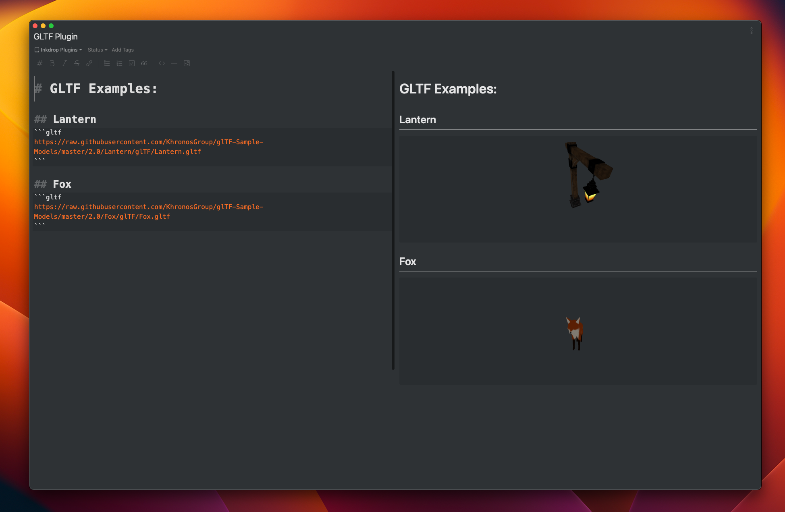

# Inkdrop GLTF Plugin


Inkdrop plugin for rendering GLTF files with [Three.js](https://threejs.org/)



## Usage

Create a fenced code block specifying a `gltf` identifier and paste a static URL to be fetched.

For example:

````
```gltf
https://raw.githubusercontent.com/KhronosGroup/glTF-Sample-Models/master/2.0/Lantern/glTF/Lantern.gltf
```
````

**NOTE**

This plugin renders a gltf as a static 3D asset and disables animations. Thus, all animation-related options in your configs will be ignored.
